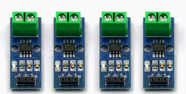
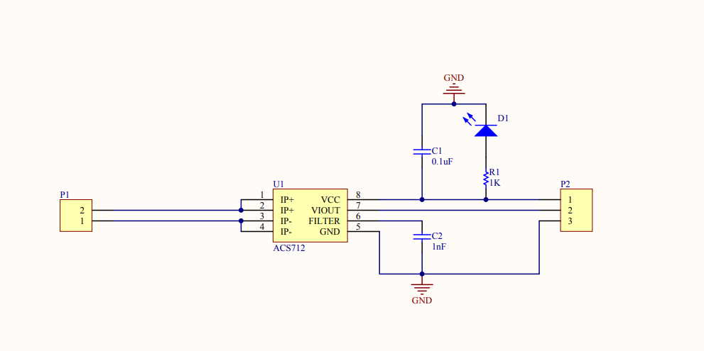
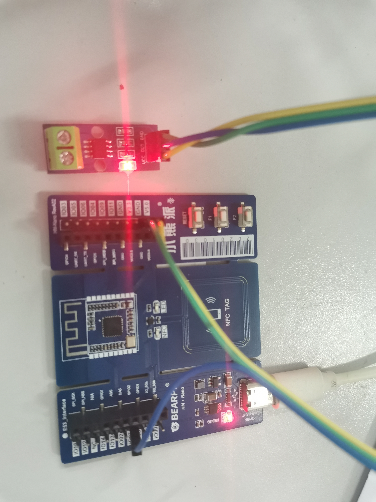
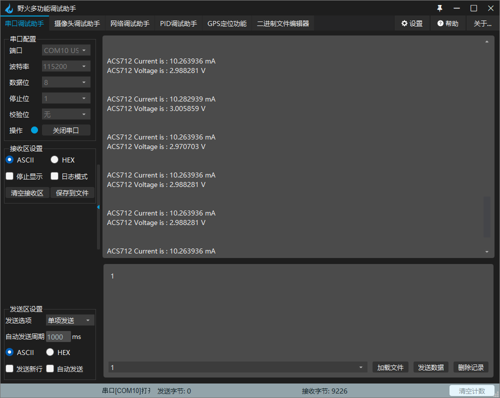

# ACS712电流传感器模块

## 一、环境配置

- 硬件：
  - Hi3861小熊派
  - ACS712ACS712电流检测模块
  - Type数据线、杜邦线
- 软件：
  - VSCode
  - DevEco插件

## 二、ACS712ACS712电流检测模块



### 2.1 原理图



### 2.2 数据手册

[数据手册](./ACS712资料/ACS712数据手册-中文.pdf)

## 三、数据计算

```
计算电压值并将结果存储在整型变量voltage中，data为ADC采样值，1.8为ADC参考电压，4为电路放大倍数，4096.0为ADC采样精度
voltage = (float)data * 1.8 * 8 / 4096.0;
current = (Voltage - 2.5) / 0.185;
```

## 四、静态测试


